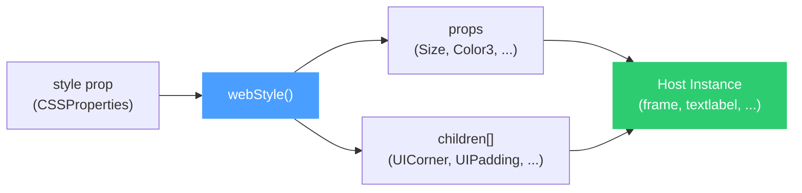
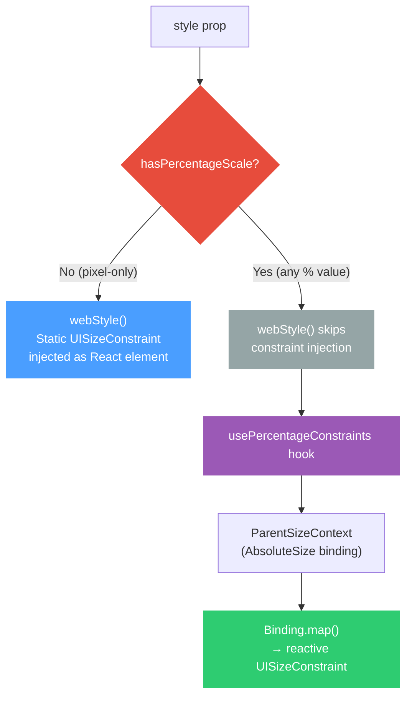

# Middleware Feature Mapping

This document outlines the specific Web/React features we are reverse-engineering into our Roblox UI middleware. It serves as the specification for what our wrapper components will support.

## System Architecture

The middleware operates as a **render-time translation layer** between two fundamentally different UI paradigms. A single pure function, `webStyle()`, accepts a `CSSProperties` object and produces a `WebStyleResult` containing Roblox instance properties and child constraint elements. Wrapper components spread the result onto their host instance.



**Before (raw Roblox):**
```tsx
<frame
  Size={new UDim2(0.5, 0, 0, 100)}
  BackgroundColor3={Color3.fromRGB(51, 51, 51)}
  BackgroundTransparency={0}
  ClipDescendants={true}
>
  <uicorner CornerRadius={new UDim(0, 8)} />
  <uipadding PaddingTop={new UDim(0, 10)} PaddingRight={new UDim(0, 20)}
             PaddingBottom={new UDim(0, 10)} PaddingLeft={new UDim(0, 20)} />
  <uilistlayout FillDirection={Enum.FillDirection.Horizontal}
                SortOrder={Enum.SortOrder.LayoutOrder} />
</frame>
```

**After (middleware):**
```tsx
<Box style={{
  width: "50%", height: "100px",
  backgroundColor: "#333",
  overflow: "hidden",
  borderRadius: "8px",
  padding: "10px 20px",
  display: "flex", flexDirection: "row",
}} />
```

## Technical Highlights

* **1,338 test assertions** across 12 spec files covering every architectural boundary.
* **Zero-abstraction-leak guarantee:** 4 branded types (`WebStyleResult`, `ParsedDimension`, `ParsedColor`, `PaddingValues`) make it impossible to bypass the middleware at compile time.
* **Reactive/static ownership split:** A `hasPercentageScale()` guard cleanly divides static pixel constraints from reactive percentage constraints.
* **Declarative constraint injection:** All UI constraints (`UICorner`, `UIPadding`, `UIListLayout`, etc.) are returned as React elements with stable keys, making them reconciler-friendly.
* **Complete CSS shorthand parsing:** `padding: "10px 20px 5px"` correctly decomposes into 4 individual UDim values.
* **5-format color engine:** Hex, `rgb()`, `rgba()`, 140+ named colors, `transparent` keyword, and Color3 pass-through.

## Table of Contents

1. [The Primitives (Element Mapping)](#1-the-primitives-element-mapping)
2. [The Box Model & Sizing](#2-the-box-model--sizing)
3. [Flexbox & Grid (Layout Engine)](#3-flexbox--grid-layout-engine)
4. [Aesthetics & Visuals](#4-aesthetics--visuals)
5. [Typography](#5-typography-for-text-and-button)
6. [Interactivity & Events](#6-interactivity--events)
7. [Design Decisions](#7-design-decisions)
8. [Testing Strategy](#8-testing-strategy)
9. [Scope Boundaries](#9-scope-boundaries)
10. [Related ADRs](#10-related-architecture-decision-records)

## 1. The Primitives (Element Mapping)
We are replacing standard HTML intrinsic elements with custom wrapper components.

| Web Element | Middleware Component | Roblox Instance |
| :--- | :--- | :--- |
| `<div>` | `<Box>` | `<frame>` |
| `<div style="overflow: auto">` | `<ScrollBox>` | `<scrollingframe>` |
| `<span>`, `<p>`, `<h1>`| `<Text>` | `<textlabel>` |
| `<button>` | `<Button>` | `<textbutton>` |
| `` | `<Image>` | `<imagelabel>` |
| `<input>` | `<Input>` | `<textbox>` |

## 2. The Box Model & Sizing
Translating CSS sizing and spacing strings into Roblox's mathematical `UDim2` system.

* **Width & Height:**
  * `"100px"` or `100` $\rightarrow$ Offset: `UDim2(0, 100, ...)`
  * `"50%"` $\rightarrow$ Scale: `UDim2(0.5, 0, ...)`
  * `"100vw"` / `"100vh"` $\rightarrow$ Viewport units parsed as Scale (`n / 100`)
  * `calc()`: `"calc(100% - 10px)"` → `UDim(1.0, -10)`
* **Size Constraints (`minWidth`, `maxWidth`, `minHeight`, `maxHeight`):**
  * *Implementation:* 
    * **Pixel values:** Automatically injects a static `<uisizeconstraint>` instance as a child.
    * **Percentage values:** Delegates ownership to the `usePercentageConstraints` hook.
* **Padding:**
  * e.g., `padding: "10px 20px"`
  * *Implementation:* Automatically injects a `<uipadding>` instance as a child of the element.
* **Positioning:**
  * Support for `position: "absolute"` along with `top`, `bottom`, `left`, `right`, and `zIndex`.
* **Layout Order (`layoutOrder`):**
  * *Implementation:* Maps directly to `LayoutOrder` on `GuiObject`.
* **Rotation (`rotation`):**
  * *Implementation:* Maps directly to `Rotation` (degrees) on `GuiObject`.

## 3. Flexbox & Grid (Layout Engine)
Modern web layout relies on Flexbox and Grid. We translate this into Roblox's `UIListLayout` and `UIGridLayout`.

* `display: "flex"` $\rightarrow$ Injects a `<uilistlayout>` child.
* `display: "grid"` $\rightarrow$ Injects a `<uigridlayout>` child.
* `display: "none"` $\rightarrow$ Sets `Visible = false`.
* `flexDirection: "row" | "column"` $\rightarrow$ Sets `FillDirection`.
* `flexWrap: "wrap"` $\rightarrow$ Sets `Wraps = true` on `<uilistlayout>`.
* `justifyContent` $\rightarrow$ Maps to `HorizontalAlignment` or `VerticalAlignment`.
* `alignItems` $\rightarrow$ Maps to the opposite alignment axis.
* `gap: "10px"` $\rightarrow$ Sets the `Padding` property on `<uilistlayout>`.
* `gridTemplateColumns` / `gridTemplateRows` $\rightarrow$ Maps to `CellSize.X` and `CellSize.Y` on `<uigridlayout>`.
* `visibility: "visible" | "hidden"` → Convenience alias that maps to `Visible`.
* `autoSize: "none" | "x" | "y" | "xy"` → Maps to `AutomaticSize`.
* `flexGrow: number` → Injects a `<uiflexitem>` child.
* `flexShrink: number` → Sets `ShrinkRatio = N` on the same `<uiflexitem>`.
* `alignSelf: "auto" | "flex-start" | "flex-end" | "center" | "stretch"` → Sets `ItemLineAlignment` on the `<uiflexitem>`.

## 4. Aesthetics & Visuals
* **Colors (`backgroundColor`, `color`):**
  A dedicated `colorParser.ts` module handles 5 input formats:
  * Hex 6-char
  * Hex 3-char
  * `rgb()`
  * `rgba()`
  * Named colors
  * `"transparent"` keyword
  * Color3 pass-through
* **Opacity (`opacity`):**
  * Formula: `BackgroundTransparency = 1 − opacity`.
* **Border Radius (`borderRadius: "8px"` or `"50%"`):**
  * *Implementation:* Injects a `<uicorner>` child.
* **Borders (`border: "2px solid black"` or `border: "2px black"`):**
  * *Implementation:* Injects a `<uistroke>` child with `Thickness={2}` and `Color={Color3.new(0,0,0)}`. Note that CSS style keywords like `solid` are optional; if omitted, the border still renders visibly by default.
* **Object Fit (`objectFit: "cover" | "contain" | "fill"`):**
  * *Implementation:* Maps directly to `ScaleType` on ImageLabels.
* **Aspect Ratio (`aspectRatio: 1.5`):**
  * *Implementation:* Injects a `<uiaspectratioconstraint>` child.
* **Box Shadow (`boxShadow: "sm" | "md" | "lg" | "xl" | "2xl"`):**
  * *Implementation:* Injects an `<imagelabel>` child utilizing 9-slice scaling.
* **Gradients (`background: "linear-gradient(...)"`):**
  * Injects a `<uigradient>` child with `Color` (`ColorSequence`), `Rotation`, and optionally `Transparency`.
* **Overflow (`overflow: "hidden"`):**
  * *Implementation:* Maps directly to `ClipDescendants = true` on the host element.

## 5. Typography (For `<Text>` and `<Button>`)
Typography mappings are explicitly split into two architectural layers to ensure separation of concerns:

* **Global Middleware Layer (`webStyle.ts`):** Handles static Roblox property resolution that applies generically.
  * **Font (`fontSize`, `fontFamily`, `fontWeight`, `fontStyle`)**
  * **Line Height (`lineHeight`)**
  * **Text Alignment (`textAlign`)**
  * **Vertical Text Alignment (`textVerticalAlign`)**
  * **Text Truncation (`textOverflow`)**
  * **Transparency (`color`)**
  * **Wrapping (`whiteSpace`, `wordBreak`)**
  * **Rich Text (`richText`)**
* **Component Layer (e.g., `Text.tsx`, `MotionText.tsx`):** Handles properties that require structural mutation of the host element or its children.
  * **Advanced Word Breaking (`wordBreak`)**
  * **Text Decoration (`textDecoration`)**
  * **Text Transform (`textTransform`)**

## 6. Interactivity & Events
Mapping React DOM standard synthetic events to Roblox's native Instance events.

* `pointerEvents: "none"` $\rightarrow$ Sets `Interactable = false` and `Active = false`.
* `onClick` / `onPress` $\rightarrow$ `Event.Activated`
* `onMouseEnter` $\rightarrow$ `Event.MouseEnter`
* `onMouseLeave` $\rightarrow$ `Event.MouseLeave`
* `onChange` $\rightarrow$ `Change.Text` (or `Event.FocusLost`)

## 7. Design Decisions

Key architectural choices and the reasoning behind them:

### Branded Types (`WebStyleResult`)

The `webStyle()` return type uses a **TypeScript branded type** (`_parsed: unique symbol`). A plain `{ props, children }` object will *not* satisfy this type at compile time.

### Pure Function + Reactive Hook Split

`webStyle()` is a **pure, stateless function** — it takes a style object and returns data. It has no access to React hooks, context, or lifecycle. When percentage-based constraints are detected, a `hasPercentageScale()` guard skips static injection entirely and delegates ownership to the `usePercentageConstraints` hook.



### Child Injection Over Imperative Mutation

Roblox UI constraints must be child instances of the element they modify. Rather than imperatively creating and parenting these after render, the middleware returns them as **React elements** in the `children` array, keeping them inside the declarative render tree.

## 8. Testing Strategy

The middleware is verified across **12 spec files** with **1,338 assertions** covering every architectural boundary. A test run reports 1,966 across 20 files, because eight of the spec sources under `src/tests/` are byte-identical duplicates that both compile and run.

## 9. Scope Boundaries

The following CSS properties are **intentionally unsupported**, each for a specific technical reason:

| CSS Property | Status | Rationale |
|:-------------|:-------|:----------|
| `margin` | ❌ Unsupported | Roblox has no margin concept. Inter-element spacing is handled via `gap` on parent instances. |
| `transform` | ❌ Unsupported | Roblox uses `CFrame` for 3D rotation/translation, which is fundamentally different from CSS 2D transforms. |
| `transition` / `animation` | ❌ Unsupported | Handled by a dedicated animation system (`react-motion`). |
| `float` / `clear` | ❌ Unsupported | Legacy CSS layout model. |
| `cursor` | ❌ Unsupported | Roblox controls cursor appearance at the engine level. |
| `flexBasis` | ❌ Unsupported | Roblox uses the item's `Size` property as the flex basis. |
| `repeating-linear-gradient()` | ❌ Unsupported | Roblox's UIGradient has no repeat mode. |

## 10. Related Architecture Decision Records

| ADR | Title | Relevance |
|:----|:------|:----------|
| [ADR-0001](adr/0001-react-to-roblox-ui-middleware.md) | React-to-Roblox UI Middleware | Founding decision — why build a CSS translation layer at all |
| [ADR-0002](adr/0002-react-motion-animation-system.md) | React Motion Animation System | Why animations are handled by a separate system rather than CSS `transition` mappings |
| [ADR-0003](adr/0003-percentage-based-size-constraints.md) | Percentage-Based Size Constraints | Reactive constraint resolution via `ParentSizeContext` |
