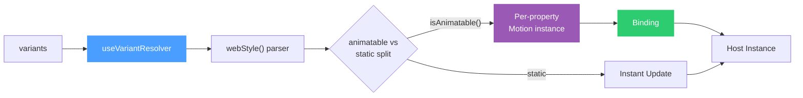

# Motion System

A Framer Motion-inspired declarative animation system for Roblox, built on `@rbxts/ripple`. It provides a variant-driven API for UI animation, seamlessly integrating with the `webStyle` CSS middleware to eliminate imperative ref juggling and manual `TweenService` sequencing.

## Architecture

The animation engine is powered by `useVariantResolver`, which translates declarative variants into discrete `Motion` instances. 



**Before (imperative TweenService):**
```tsx
const ref = useRef<Frame>(undefined!);
useEffect(() => {
  const tween = TweenService.Create(
    ref.current, 
    new TweenInfo(0.3), 
    { BackgroundTransparency: isHovered ? 0 : 1 }
  );
  tween.Play();
  return () => tween.Cancel();
}, [isHovered]);

return <frame ref={ref} BackgroundTransparency={1} />;
```

**After (declarative MotionBox):**
```tsx
<MotionBox
  animate={isHovered ? "hover" : "idle"}
  variants={{
    idle: { backgroundColor: "transparent" },
    hover: { backgroundColor: "#ffffff" }
  }}
  transition={new TweenInfo(0.3)}
/>
```

## The API

The system exposes a standard motion API via component props:

* **`animate`** — A string key selecting the active variant.
* **`initial`** — An optional string naming the variant to use as the starting state on mount. This seeds the Ripple bindings before the first tween fires, preventing a flash-to-target on first render. Fallback priority: `initial` prop → `"idle"` key → current `animate` target → first value found in any variant.
* **`variants`** — A record of named style objects. These objects can contain both CSS properties and raw Roblox properties.
* **`transition`** — A `TweenInfo` object controlling duration, easing, delay, repeat count, and reverses.

```tsx
<MotionButton
  animate={state} // "hidden", "visible", or "pressed"
  variants={{
    hidden: { opacity: 0, scale: 0.8, pointerEvents: "none" },
    visible: { opacity: 1, scale: 1.0, pointerEvents: "auto" },
    pressed: { scale: 0.95 }
  }}
  transition={new TweenInfo(0.4, Enum.EasingStyle.Back, Enum.EasingDirection.Out)}
  onClick={() => print("Clicked!")}
/>
```

## The 5 Motion Primitives

Animated elements use custom wrapper components that wrap the `useVariantResolver` hook. The pattern is consistent across all UI primitives:

| Component | Host Instance |
| :--- | :--- |
| `<MotionBox>` | `<frame>` |
| `<MotionText>` | `<textlabel>` |
| `<MotionButton>` | `<textbutton>` |
| `<MotionImage>` | `<imagelabel>` |
| `<MotionUIScale>` | `<uiscale>` |

## Integration with `webStyle`

* **CSS property translation:** Variant style objects pass through the exact same `webStyle()` parser as static styles. This means CSS properties inside variants (e.g., `backgroundColor: "#ff0000"`, `opacity: 0.5`) are correctly translated to `BackgroundColor3` and `BackgroundTransparency`.
* **Roblox property pass-through:** Raw Roblox properties (PascalCase keys like `ImageTransparency` or `TextScaled`) pass through directly via an uppercase-first-character check in the parser, allowing complete control over engine-specific fields.

## Animatable Type Detection

To avoid passing non-tweenable values to Ripple, the resolver uses an `isAnimatable()` guard. 
* It auto-classifies the following types as animatable: `number`, `UDim`, `UDim2`, `Vector2`, `Vector3`, `Color3`, `CFrame`, and `Rect`.
* Non-animatable properties (strings like `pointerEvents`, booleans, enums) bypass the motion engine and are applied as instant static updates.
* This split is computed **exactly once** via `useMemo` when the variants are parsed, guaranteeing it is not re-computed on every render.

## The Loop/Reverse Engine

While Ripple is a powerful engine, it does not natively support repeating or reversing animations. `useVariantResolver` implements a **custom loop state machine** running on `RunService.Heartbeat` on top of Ripple's `motion.isComplete()` event.

* Fully supports `TweenInfo` properties: `RepeatCount` (including `-1` for infinite loops) and `Reverses`.
* Combines repeating and reversing seamlessly for ambient animations (e.g., breathing effects).
* **Independent property loops:** Each animatable property is tracked and looped independently, preventing desynchronization.

## Testing Strategy

The motion system is verified by **96 test assertions** across 3 spec files:

| Spec File | Assertions | Focus |
| :--- | :--- | :--- |
| `MotionPrimitives.spec.tsx` | **62** | Primitive wrappers, prop passthrough, variant parsing, CSS property translation (color, fontSize, textAlign, fontFamily), `AutomaticSize` fallback logic, and child element rendering |
| `transitions.spec.ts` | **16** | Transition configs and TweenInfo mappings |
| `useVariantResolver.spec.tsx` | **18** | Core hook behavior, binding updates, loop state, `initial` prop seeding, and fallback chain verification |

## Scope Boundaries

To maintain a focused abstraction, certain features are intentionally omitted:
* **No `AnimatePresence` (enter/exit):** Supporting unmount animations requires intercepting the React lifecycle, which adds significant complexity.
* **No spring physics:** We strictly use Ripple's tween model driven by `TweenInfo` easing curves to match Roblox's native animation feel.
* **No gesture-driven animation:** The Roblox input model does not support native DOM-style pan/drag gestures.
* **No layout animations:** Components do not animate their own positional flow; layout is strictly managed by `UIListLayout` and `UIGridLayout`.

## Internal Extension Point

`useVariantResolver` accepts an optional 4th `parser` argument — a function that converts a variant style object into resolved Roblox properties. This is not part of the public component API (no Motion primitive exposes it as a prop). Its purpose is to provide a testing seam: the spec files inject a simplified parser to isolate hook behavior without exercising the full `webStyle()` pipeline.

## Related Architecture Decision Records

* [ADR-0002: React Motion Animation System](adr/0002-react-motion-animation-system.md)
